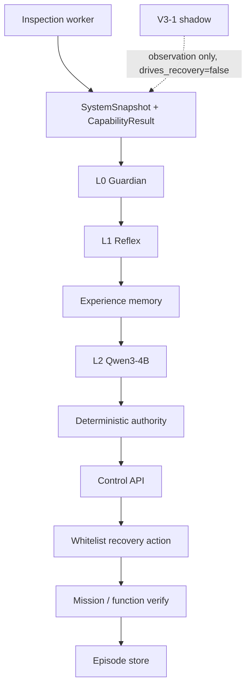

# SRTP final research evidence index

```text
FEATURE DEVELOPMENT FREEZE
EVIDENCE CONSOLIDATION
LIMITATION ANALYSIS
FINAL DEMO / REPORT PREPARATION
```

Do not add recovery verbs, fault families, RQ1 prompt edits, memory farming, Health Graph work, or V3-2/V3-3. Fresh holdout stays `UNTOUCHED` until a true fresh split exists.

This file is the index. Detailed numbers live in the linked reports; do not re-average them here.

---

## Frozen claims

```text
RQ1 — Structured State
SUPPORTED, FAMILY-LIMITED

RQ2 — Experience Memory
MECHANISM VERIFIED ACROSS TWO LIVE FAULT SIGNATURES
general effectiveness NOT YET VALIDATED
recovery success improvement NOT ESTABLISHED

RQ3 — Autonomous Recovery Runtime
LIVE END-TO-END MECHANISM VERIFIED
physical camera / serial hardware fault recovery NOT VALIDATED
```

---

## Architecture (frozen)

V3-1 is **shadow capability observation, not recovery authority**.

```text
Inspection
    ↓
SystemSnapshot + CapabilityResult
    ↓
L0 / L1          (deterministic)
    ↓
Experience Memory
    ↓
L2 Qwen3-4B      (unreliable small model)
    ↓
Deterministic Authority / Control
    ↓
Recovery Action  (whitelist only)
    ↓
Verification     (no Verify ⇒ not SUCCESS)
    ↓
Episode Memory   (learn only after verified success, gate ≥ 3)
```



EdgeMedic and GearPro stay separate processes. Agent talks HTTP Control only.

---

## RQ1

**Question:** Under the same 4B model, action space, and information, does structured state improve diagnosis / recovery proposals and reduce unsafe or useless decisions?

**Status:** `SUPPORTED, FAMILY-LIMITED`

| Item | Value |
| --- | --- |
| Protocol | `srtp-rq1-formal-v1` (not the v1 pilot) |
| n | 30 independent paired cases, 6 families, 0 generation repeats |
| strict success | structured 0.30 / raw 0.13 |
| paired | structured-only wins 5, raw-only wins 0, both fail **21/30** |
| tokens / latency | 761 vs 582 prompt tokens; 2185 vs 1660 ms |

**Trade-off to report:** Structured state improved decision success on a subset of fault families, most notably `CAMERA_STALE`, but increased prompt size and inference latency. Its benefit was therefore fault-dependent rather than universal.

**Ceiling:** 21/30 paired cases failed under both views. Representation engineering can help some cases; it does not lift the current small-model reasoning ceiling.

All 5 structured-only wins were `CAMERA_STALE`. No observed improvement on PAUSE / WORKER / V5 / LOCATOR. SERIAL similar in both modes. Unsafe rate 0/0. Do not write “structured input is better.”

Report: `docs/srtp-rq1-formal-evaluation.md`  
Cases: `edgemedic/cases/rq1_formal_v1/` (`cases_sha256=e06ee50fd7599d91626add09d7eeab8f89818bb6d96066641cb8e913bc9e1245`)  
NX: `/home/jetson/Projects/edgemedic-live/results/rq1_formal_v1/summary.json`  
Pilot (`srtp-structured-vs-raw-v1`) stays appendix-only. Do not mix counts.

---

## RQ2

**Question:** Can verified experience help the edge agent on known faults?

**Status:** mechanism verified on two live signatures; general effectiveness not established.

| Live signature | Memory ON (L1 off, controlled) | Memory OFF (L1 off, controlled) |
| --- | --- | --- |
| `INSPECTION_PAUSED` | MEM `resume_inspection` → RECOVERED | L2 wrong pause → Control reject → FAILED |
| `CAMERA_STALE` | MEM `restart_camera` → RECOVERED, e2e 2235 ms, L2 skipped | L2 `restart_camera` → RECOVERED, L2 2424 ms, e2e 4626 ms |

`CAMERA_STALE`: memory’s observed benefit is skipping expensive but eventually correct L2.  
`INSPECTION_PAUSED`: memory can avoid unreliable L2; Control still fail-closed when L2 is wrong.

Controlled routing (`disable_l1=true`), not natural runtime routing. Gate still `≥ 3` verified successes. Episodes not hand-written.

Reports: `docs/srtp-rq2-cross-fault-memory.md`, `docs/srtp-rq2-frozen.md`  
NX: `/home/jetson/Projects/edgemedic-live/results/rq2_camera_stale_memory/summary.json`

---

## RQ3

**Question:** Does the bounded edge runtime actually close the loop?

**Status:** live end-to-end mechanism verified for two distinct NX runtime families.

```text
inspection → incident → L1/MEM/L2 → Control → execute → mission verify → RECOVERED
```

1. `INSPECTION_PAUSED` (Control pause, not a synthetic overlay)  
2. `CAMERA_STALE` on the **replay capture pipeline** (env-gated freeze; telemetry ages on the normal path)

Wording: 在 Jetson NX 实际运行环境中，系统已对 `INSPECTION_PAUSED` 与 replay capture pipeline 的 `CAMERA_STALE` 两类独立运行时故障完成端到端恢复验证。进一步的物理摄像头、串口等硬件故障验证受实验平台和安全注入条件限制。

Report: `docs/srtp-second-live-injector-outcome.md`  
Injector: `GEARPRO_RESEARCH_INJECT=1` only; freeze file ignored otherwise.

---

## Safety

- L0/L1 deterministic; L2 after L1/memory miss  
- Whitelist, timeout, retry, Verify; no Verify ⇒ not SUCCESS  
- L2 recommendation ≠ execution authority  
- Profile / backend / worker / config: dry-run / REQUIRE_APPROVAL in live research  
- `pause` / `resume` / `restart_camera` / `reconnect_serial`: AUTO_LOW_RISK  
- RQ1: zero unsafe proposals on the formal set; GBNF schema_valid = 1.0  
- RQ2 pause memory-off: Control rejected an incorrect L2 pause  

Do not equate APIs with proven ASR/MTTR.

---

## V3 capability work

| Item | Status |
| --- | --- |
| V3-1 candidate | `e8b2b0f` |
| Role | shadow CapabilityResult observation |
| `drives_recovery` | `false` |
| Fresh holdout | `UNTOUCHED` |
| Registry | unchanged |
| V3-2 / V3-3 | not started |

Capability signals may inform L2 diagnosis. They must not be the sole reason to pick a recovery verb.

---

## Limitations (report these; do not paper over them)

- RQ1 gain is family-limited; 21/30 both-fail shows a model-capability ceiling  
- Structured prompts are longer and slower  
- RQ2 n=1 pairs per signature; no statistical success-rate claim  
- RQ2 memory-vs-L2 used controlled L1-off routing  
- RQ3 `CAMERA_STALE` is replay-pipeline freeze, not `/dev/video*` unplug  
- No physical serial/camera hardware recovery  
- NX replay cannot safely emit many live incident families  
- Agent architecture is sufficient for this SRTP stage; the remaining gap is experimental, not “need a bigger agent”

---

## Artifact / commit provenance

Branch: `experiment/v3-1-holdout-adjudication`

| Commit | Role |
| --- | --- |
| `e8b2b0f` | V3-1 freeze |
| `c5eebd1` | research-only replay capture freeze injector |
| `3e026d7` | RQ2 CAMERA_STALE live memory pair |
| `d270fbb` | RQ1 formal cases frozen before Qwen |
| `75c83c5` | RQ1 formal evaluation report |

Remote: `origin/experiment/v3-1-holdout-adjudication`

Demo (do not improvise): `docs/final-demo.md`, `tools/nx_final_demo.py`
