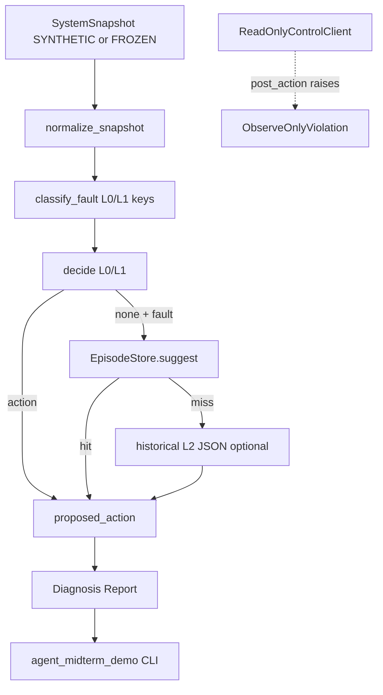
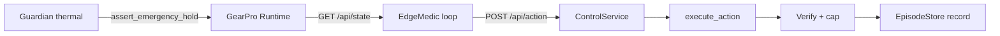

# EdgeMedic Agent 中期技术报告

> 范围：中期答辩用 Agent 模块。不是完整 SRTP 验收报告。  
> 集成分支：`integration/dual-specialist-edgemedic`  
> 演示模式：**observe-only**（只诊断与提案，不执行恢复）

---

## 1. 项目背景与目标

### 1.1 SRTP 要解决什么问题？

边缘视觉检测（GearPro）长期运行时会出现摄像头卡顿、检测暂停、Worker 异常、热保护停机等故障。完全依赖人工巡检成本高；若把不可靠的小 LLM 直接接到控制面，又容易误动作。

EdgeMedic 的研究目标是：在**有界动作空间**内，用「确定性规则 + 经验记忆 + 可选小模型」做故障诊断与恢复提案，且每一步可验证、可回滚、可拒绝。

### 1.2 Agent 在 SRTP 中的职责

| 职责 | 说明 |
|---|---|
| 读取结构化状态 | SystemSnapshot（非原始日志） |
| 故障分类 | L0/L1 规则优先 |
| 经验路由 | EpisodeStore（MEM） |
| 未知故障推理 | L2 Qwen3-4B（白名单工具 JSON） |
| 与执行解耦 | 通过 Control API；本中期 Demo **不调用**写接口 |

Agent **不是** GearPro 检测内核，也不替代 Qt/Web 人机界面。

### 1.3 为何规则 + 记忆 + 小模型

- 已知简单故障（如 `CAMERA_STALE`）应由确定性规则在毫秒级处理，避免 LLM 延迟与幻觉。
- 重复验证成功的恢复可进入 EpisodeStore，减少重复调用 L2（机制演示，不宣称成功率提升）。
- 未知或规则未覆盖故障才进入 L2；输出必须落在工具白名单内。

### 1.4 与 GearPro 的边界

```
GearPro Runtime  ←→  Control API (:8787)  ←→  EdgeMedic Agent
     ↑                      ↑
  相机/推理/串口          白名单·超时·Verify
```

- Agent **不得** `import gp` 内部实现（正式设计）；不得任意 shell。
- Web 人工变更走 lease → `human_action` → Control；Guardian 可紧急 SAFE_STOP。
- 中期 Demo 进一步收紧：使用 `ReadOnlyControlClient`，**结构上禁止** `post_action`。

### 1.5 研究原型 vs 本分支集成版

| | NX overlay `edgemedic-live` | 本集成分支中期 Demo |
|---|---|---|
| 位置 | `/home/jetson/Projects/edgemedic-live`（Git 外） | `edgemedic/` + `tools/agent_midterm_demo.py` |
| Demo A/B/C | 已验收 replay 恢复闭环 | **仅展示冻结数字**，标注 FROZEN REPLAY |
| 自动恢复 | overlay 可执行（历史） | **禁用** |
| 双专项 Runtime | 与 main-web 集成并行 | Step 6.0–6.3 已在同分支 |
| 本机可达性 | Windows 工作站 **不可达** | 可本地运行只读诊断 |

---

## 2. 总体技术架构

### 2.1 当前已实现（中期可演示）



### 2.2 未来正式 SRTP 集成（尚未在本 Demo 开通）



**未画成已完成**：常驻 `run_loop` 自动恢复、调用者身份认证、真机故障注入。

### 2.3 数据流（真实代码）

1. Snapshot 来自 `docs/midterm/scenarios/*.json`（标记 `SYNTHETIC`）或只读 `get_state`（本 Demo 默认不用）。
2. `edgemedic.observe.normalize_snapshot` 将 v2 `specialists.scratch_v5` 投影到顶层供 L1 使用。
3. `policy.classify_fault` / `decide`：L0 热保护、L1 暂停/卡顿/Worker/串口/过载。
4. `memory.EpisodeStore.suggest`：需 ≥3 次 verified success。
5. L2：本 Demo **默认不调用** Qwen；Memory OFF 场景加载 `docs/midterm/frozen/l2_camera_stale_historical.json`。
6. 报告字段强制 `actually_executed=false`、`recovery_claimed=false`。

---

## 3. Agent 核心决策机制

| 层 | 职责 | 触发 | 输出 |
|---|---|---|---|
| L0 | 热保护 SAFE_STOP | T≥80°C 且非 SAFE_STOP | `set_inference_profile SAFE_STOP` |
| L1 | 已知故障反射 | 分类命中且 cooldown 冷却 | 白名单动作 |
| MEM | 经验建议 | L1 未出动作且 Episode 命中 | 历史成功动作 |
| L2 | 小模型提案 | 规则/记忆不足 | `{tool, params}` |

优先级：L0 → L1 → MEM → L2。  
失败处理：正式环路由 Verify 判定；本 Demo 不执行，故无 Verify 升级。

**为何不全交给 Qwen：** 延迟、token、幻觉、以及已知故障应确定性处理（RQ1/RQ3 动机）。

**Authority：** 正式路径上 L2/`reasoner` 源需过 Control accept；L1/MEM 以 `reflex`/`memory` 源进入。本 Demo 明确：**不提交 Authority**，只说明 `would_require_control_accept`。

**局限：** L1/MEM 在历史 overlay 中未必与 L2 同等 Authority 门控——文档不隐瞒；集成后应以 Control 白名单为统一闸门。

---

## 4. 小模型技术实现

| 项 | 内容 |
|---|---|
| 模型 | Qwen3-4B（历史 NX 部署） |
| 服务 | llama-server 类 OpenAI 兼容 API（`edgemedic/reasoner.py`） |
| 输入 | SystemSnapshot JSON + 系统 Prompt |
| 输出 | 单一 JSON：`{"tool": "...\|null", "params": {}}` |
| 约束 | 工具白名单 + GBNF grammar（`ACTION_GBNF`） |
| 异常 | `ReasonerError`；正式环路打印不可用并跳过 |

**本中期现场：** `l2.invoked_live=false`。Memory OFF 展示的是 **HISTORICAL REPLAY**，不是实时推理。

Qwen 负责：未知故障的白名单工具提案。  
不负责：任意 shell、改阈值、绕过 Guardian、声称任务级 RECOVERED。

---

## 5. EpisodeStore 与记忆

- Key：`signature|name|params_json`
- 写入：仅 `verify_level` 为 function/mission 的成功（config 不入库）
- 命中：`successes ≥ 3` 且 wins > fails
- 中期 Demo：使用 `docs/midterm/frozen/episodes_camera_stale.json` 的**副本**到临时目录，**不修改**冻结文件

Demo C（历史，非本次执行）：

| | Memory ON | Memory OFF |
|---|---|---|
| route | MEM | L2 |
| l2_invoked | false | true |
| e2e_ms | 2241 | 4929 |
| l2_ms | — | 2704 |

**边界：** 机制演示 ≠ 恢复成功率提升的统计证明。

---

## 6. 安全机制

| 机制 | 状态 |
|---|---|
| 动作白名单 | 代码存在（Control `actions.SPECS` / reasoner ALLOWED_TOOLS） |
| Control 预检 | Step 6.2 已接入 |
| Guardian + emergency hold | Step 6.3 单测通过 |
| 双专项 Verify + cap | Step 6.3；无证据不记 RECOVERED |
| 中期 ReadOnlyClient | `post_action` 抛 `ObserveOnlyViolation` |
| 调用者身份认证 | **未完成** |
| 真机故障注入 | **未做**（禁止） |
| 生产安全验收 | **未宣称** |

语义区分：建议 ≠ 批准 ≠ 执行 ≠ config_verified ≠ function/mission ≠ recovery_success。

---

## 7. 双专项系统集成（Step 6.0–6.3）

从 `main-web@de608d9` 基线选择性接入 `srtp-web` Control，而非整分支 merge。

| Step | 内容 |
|---|---|
| 6.0 | 独立集成分支 |
| 6.1 | 双专项类型/阈值/Worker 钩子 |
| 6.2 | Control + Web human_action 统一 |
| 6.3 | Guardian 仲裁、专项状态、Verify 证据门槛 |

**Agent 自动恢复：未开放。** 中期仅为只读诊断入口。

---

## 8. 研究问题与实验成果（冻结证据口径）

### RQ1（结构化状态 vs 原始日志）

- family-limited；不得外推普遍优势。
- 引用口径：0.30 vs 0.13；5 个 structured-only win 均属 `CAMERA_STALE`；21/30 双失败；保留 token/latency 代价。
- 原始表在历史实验仓库/报告中；本工作站未重跑。

### RQ2（Episode / MEM）

- 见 §5 Demo C 数字；机制演示 only。

### RQ3（Replay 恢复闭环）

- Demo A：`INSPECTION_PAUSED` e2e≈2153ms  
- Demo B：`CAMERA_STALE` e2e≈2136ms  
- **replay pipeline**，非物理设备故障测试。

### V3-1

- Shadow observation；`drives_recovery=false`；holdout=UNTOUCHED。

---

## 9. 实验结果与性能（分类）

| 类型 | 内容 |
|---|---|
| 正式实验统计 | RQ1 等，见历史冻结报告（未在本次重算） |
| 历史单次 Demo | A/B/C 数字见 `docs/midterm/frozen/demo_abc_historical.json` |
| 本次新运行 | `docs/midterm/runs/*.json`：只读诊断耗时毫秒级；**无恢复、无 L2 live** |

禁止混合统计。

---

## 10. 工程实现

### 核心路径

| 路径 | 作用 |
|---|---|
| `edgemedic/policy.py` | L0/L1 分类与决策（含 `INSPECTION_PAUSED`） |
| `edgemedic/memory.py` | EpisodeStore |
| `edgemedic/observe.py` | 只读 diagnose |
| `edgemedic/readonly_client.py` | 禁止写 Control |
| `tools/agent_midterm_demo.py` | CLI 入口 |
| `docs/midterm/scenarios/` | 合成 Snapshot |
| `docs/midterm/frozen/` | 冻结/历史材料 |
| `gp/control.py` 等 | GearPro Control（Demo 不调用写） |

### 启动 / 停止

```bat
cd /d G:\CODE\Machine_vision-dual-specialist
set PYTHONPATH=G:\CODE\Machine_vision-dual-specialist
python tools/agent_midterm_demo.py --scenario all --show-frozen-abc
```

Ctrl+C 即可；无常驻守护进程。  
`python -m edgemedic` 指向的是完整 poll 环路（含 `post_action`），**中期答辩请勿使用**，改用上述 demo 入口。

---

## 11. 局限性与后续

1. NX overlay 未入 Git，本机不可达 → Demo A/B/C 仅历史引用。  
2. 实模型加载：本环境 PyTorch 缺失，测试 skip。  
3. Agent 只读 Demo 已完成；**只读常驻接入 Control GET 可选后续**。  
4. 自动恢复未开放；`:8787` 仍可被同机进程以 agent 权限调用（风险保留）。  
5. Guardian 温度依赖 snapshot 字段；Jetson 热区未完整接线。  
6. 完整事务回滚未验证。  
7. Step 6.4 Agent 生产接入 ≠ 本中期交付。

---

*本文档对应可运行代码与单元测试；研究结论只引用已声明的冻结证据口径。*
